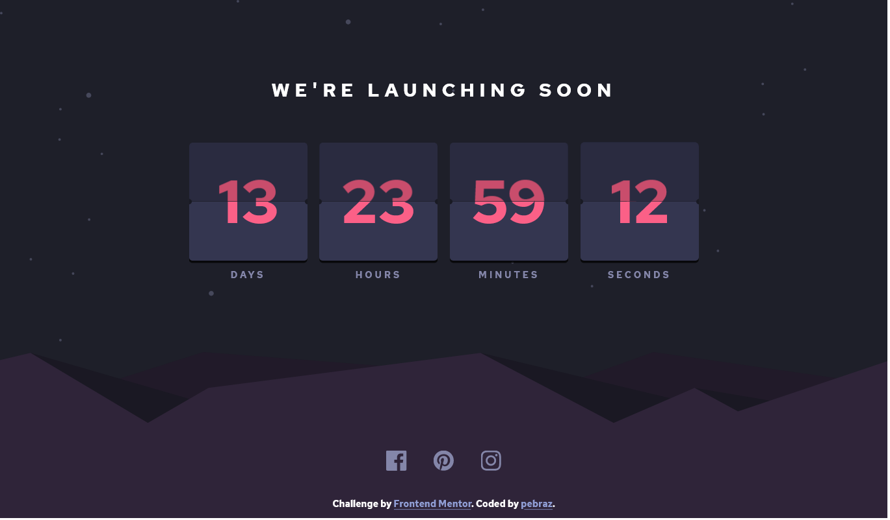

# Frontend Mentor - Launch Countdown timer
This is my solution to this [this challenge](https://www.frontendmentor.io/challenges/launch-countdown-timer-N0XkGfyz-).

Built only with HTML, CSS & Javascript. 

There are 2 fixed layouts for the design:
 - Destktop @1440px
 - Mobile @375px
 
## Screenshot

## Improvements

- The animation isn't always being trigered and the styling could be improved to make it more obvious
- Could add a linear gradient to make it match the design better